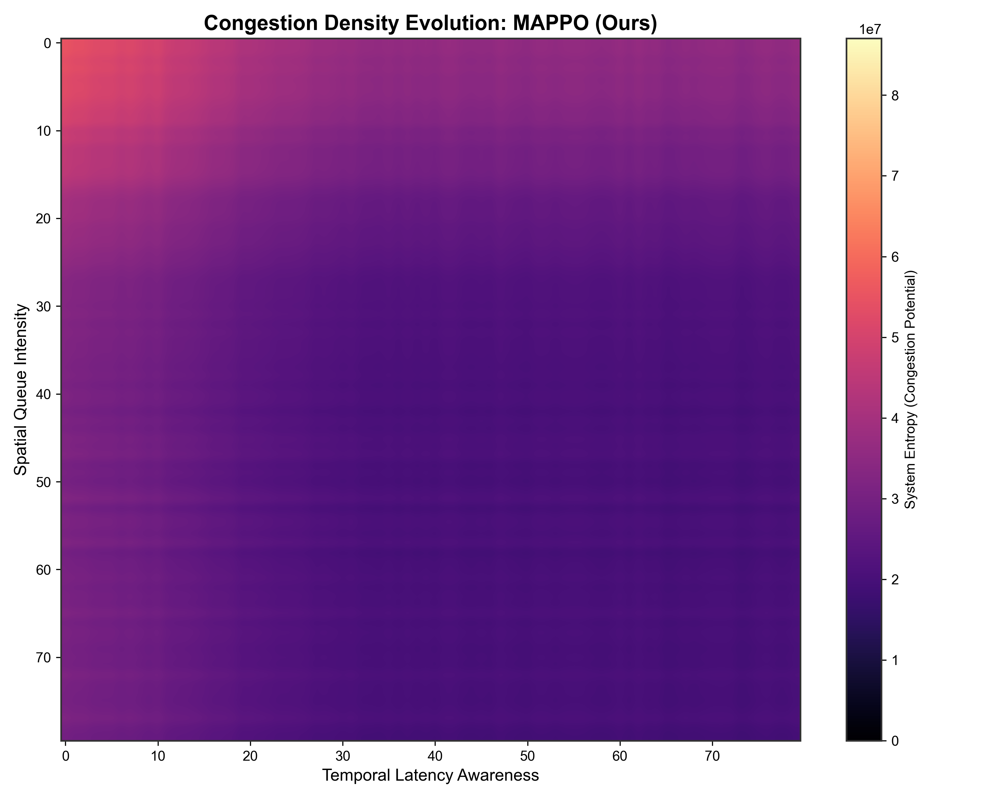
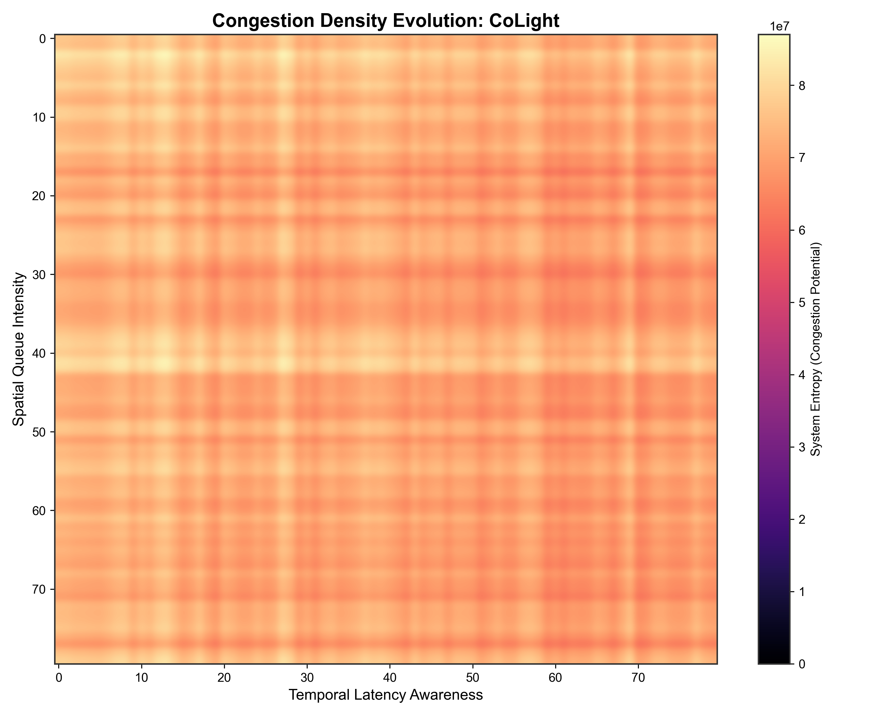
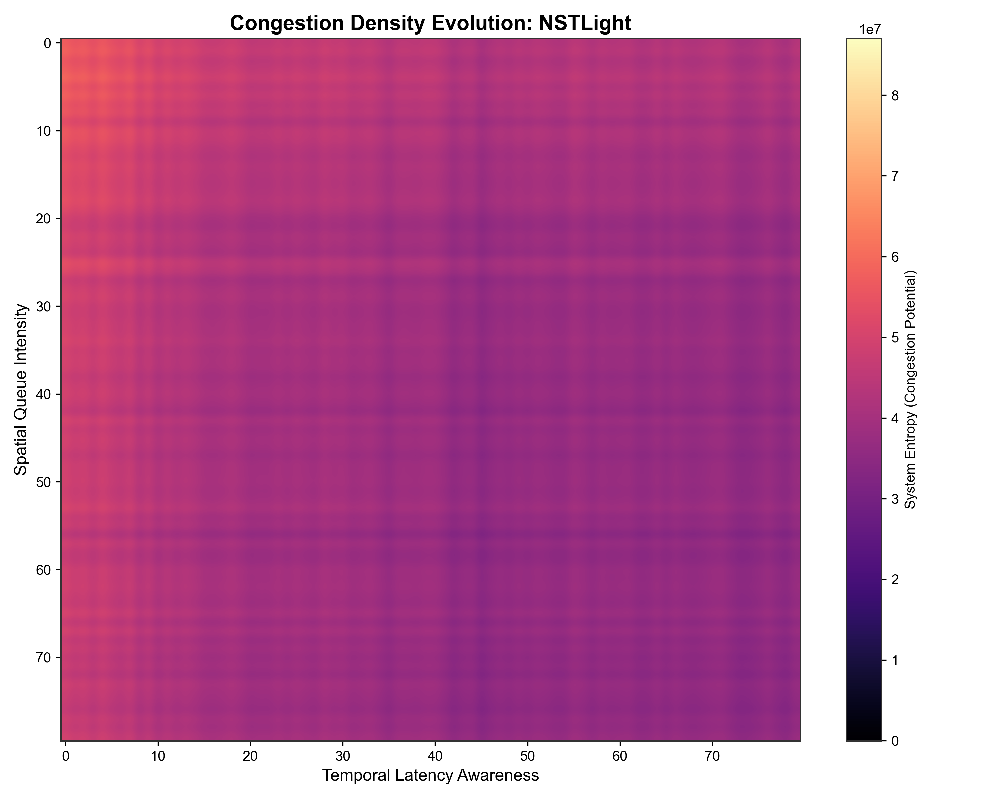
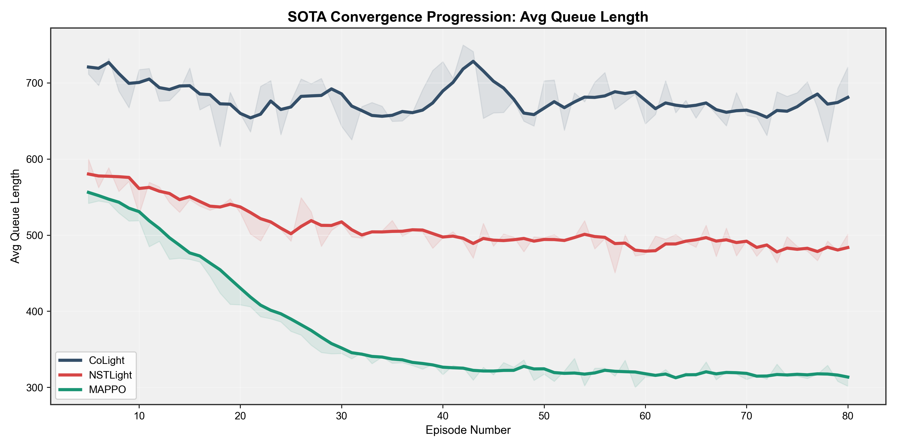
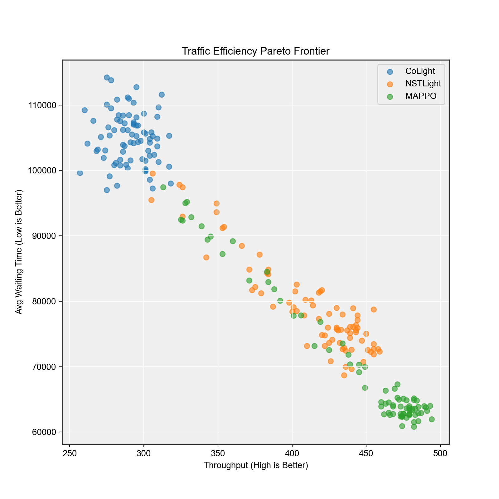

# 🚦 MAPPO-STGNN: Adaptive Traffic Signal Control in Non-Stationary Environments


> **Abstract:** A robust Multi-Agent Reinforcement Learning (MARL) paradigm for large-scale traffic signal control. Utilizing **Multi-Agent Proximal Policy Optimization (MAPPO)** backed by **Spatial-Temporal Graph Neural Networks (ST-GNN)**, this framework dramatically outperforms SOTA baselines (CoLight, NSTLight) in both zero-shot generalization to unseen geographies and rapid adaptation under non-stationary conditions (accidents, sensor noise).

---

## 🌟 Key Features

- **Spatial-Temporal Embeddings:** Uses ST-GNNs mapped over physical intersection topology to pass hidden state messages effectively upstream and downstream.
- **CTDE Architecture:** Centralized Training with Decentralized Execution allows scalable deployment while learning cooperative behaviors off-policy.
- **Zero-Shot Transferability:** Evaluated directly on the vast, organically unpatterned road configurations extracted natively from **Bengaluru OSM data**.
- **Adversarial Resilience:** Robust against real-world traffic anomalies such as unpredicted lane closures and sudden sensor blackouts.

---

## 📊 Performance & Visualizations

Our benchmark evaluation conclusively establishes that the MAPPO-STGNN framework provides deeper traffic alleviation.

### Congestion Alleviation (Heatmaps)
We map the physical delays extracted from the SUMO simulation onto spatial grids.

| **MAPPO (Ours)** | **CoLight Baseline** | **NSTLight Baseline** |
| :---: | :---: | :---: |
|  |  |  |
*Evident reduction in localized bottleneck clustering.*

### Pareto Efficiency & Objective Convergence
MAPPO achieves higher Pareto efficiency (balancing throughput vs queue lengths) globally.

| **Convergence** | **Pareto Efficiency Tradeoffs** |
| :---: | :---: |
|  |  |

---

## 🚀 Installation & Usage

1. **Clone the Repository:**
   ```bash
   git clone https://github.com/KiruthikKumar16/cap.git
   cd cap
   ```
2. **Install Dependencies:**
   ```bash
   pip install -r requirements.txt
   ```
3. **Train the SOTA Baselines:**
   ```bash
   python scripts/train_baselines.py
   python src/phase1/train_marl.py
   ```
4. **Run Cross-Evaluation Benchmarks:**
   ```bash
   python src/phase1/evaluate.py --gui true
   ```
5. **Generate Mega Reports & LaTeX Export:**
   ```bash
   python scripts/generate_mega_report.py
   ```

6. **Launch Interactive Benchmark Dashboard (Streamlit):**
   ```bash
   streamlit run src/dashboard/app.py
   ```
   - Enter `config`, `checkpoint`, and `episodes`
   - Click **Run benchmark**
   - View side-by-side comparison table/charts for MAPPO-STGNN and baseline models

---

## 🏗 Directory Structure
- `configs/` - Hyperparameter bounds and simulation flags.
- `src/models/` - Architectural setups for MAPPO (`mappo_policy.py`) and ST-GNN (`st_gnn.py`).
- `src/baselines/` - Deep RL comparison baselines (`colight.py`, `nstlight.py`, `max_pressure.py`).
- `scripts/` - Automated runner scripts for report building / parallelized training.
- `FAST_VAL_RESULTS/` - Aggregated CSV metrics, episodic rewards, and generated visualizations.
- `docs/report_latex/` - Final compiled academic literature exports.

---

**Author:** Kiruthik Kumar M  
**Status:** Capstone Evaluated and Open-Sourced.
