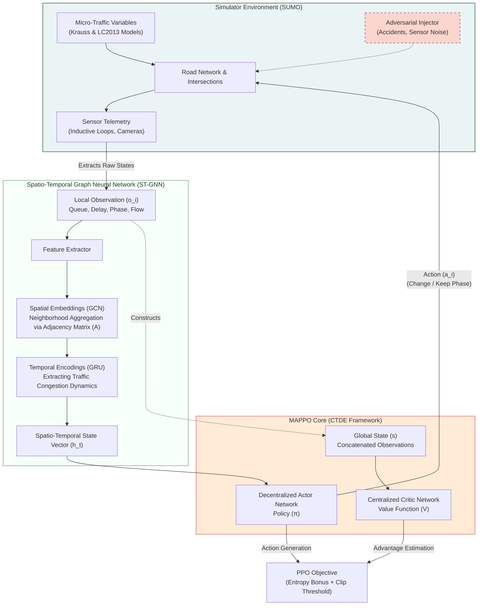

# MAPPO-STGNN Architecture and System Diagram

This document contains a publication-standard system architecture diagram for the MAPPO-STGNN framework.

## System Architecture Diagram

### Flowchart Breakdown

1.  **Environment (Simulation Layer):** The physical traffic kinematics execute inside SUMO. The road network generates raw sensor data detailing local intersection congestion (delay, queues). Additionally, the module highlights the injection of non-stationary anomalous events (sensor noise, network accidents) to test model robustness.
2.  **ST-GNN (State Representation Layer):**
    *   *Spatial Construction:* Evaluates intersection vectors using Graph Convolutional Networks (GCNs) mapping influences using a defined physical network Adjacency Matrix.
    *   *Temporal Dynamics:* Embeds spatial outputs sequentially through Gated Recurrent Units (GRUs), generating a high-density, anticipatory state vector reflecting approaching traffic waves.
3.  **MAPPO (Control Layer):** Structured under the **C**entralized **T**raining with **D**ecentralized **E**xecution paradigm.
    *   During active inference, only the decentral Actor responds (utilizing the rich Spatial-Temporal embeddings).
    *   During training algorithms, the Centralized Critic processes the composite global map, solving Markov violations and maintaining global stability across multiple independent actors.
