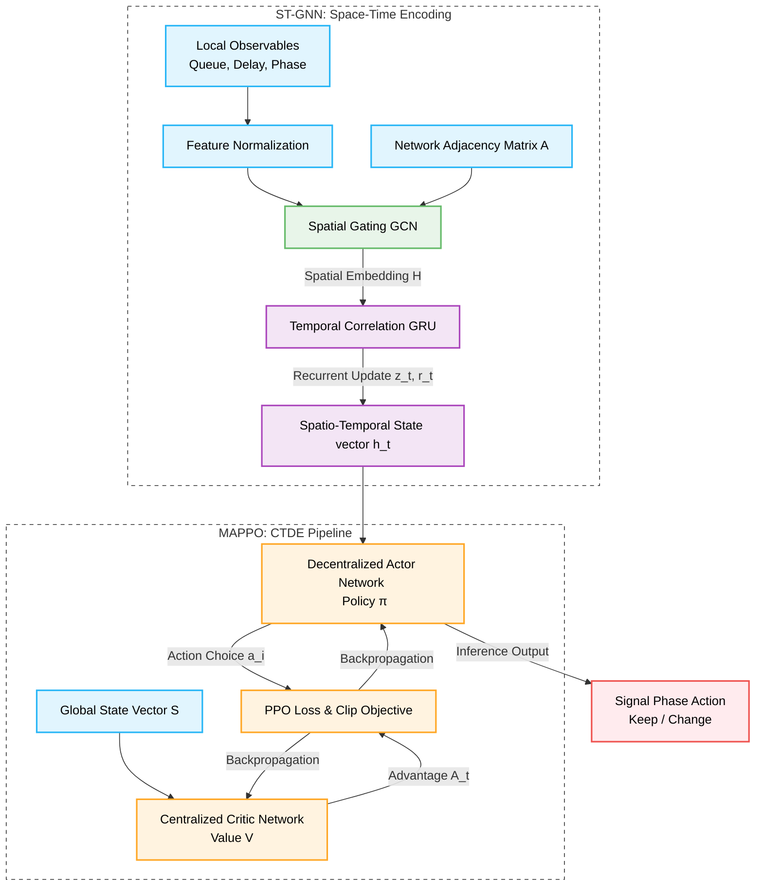

# MAPPO-STGNN Framework Diagrams

This document contains two distinct diagrams structured for publication, both configured with explicit white backgrounds to ensure clean rendering in research papers or presentations.

## 1. Algorithmic Architecture Diagram
This diagram focuses on the logical structure and mathematical flow of the deep learning components (ST-GNN + MAPPO).

---

## 2. System Execution & Deployment Diagram
This diagram illustrates how the software operational loop executes within the real-world or simulated environment, focusing on component interactions via the API.

```mermaid
%%{init: {'theme': 'default', 'themeVariables': { 'background': '#ffffff'}}}%%
graph LR
    classDef sim fill:#eceff1,stroke:#78909c,stroke-width:2px,color:#000;
    classDef api fill:#fff8e1,stroke:#ffca28,stroke-width:2px,color:#000;
    classDef exec fill:#e0f7fa,stroke:#26c6da,stroke-width:2px,color:#000;
    classDef train fill:#fdf4fc,stroke:#ec407a,stroke-width:2px,color:#000;

    subgraph Env [Environment Module]
        Sumo[SUMO Engine <br> Traffic Kinematics]:::sim
        Sensors[Virtual Sensors & Induction Loops]:::sim
        Sumo --> Sensors
    end

    subgraph API [API Gateway]
        TraCI[TraCI Python Interface]:::api
    end

    subgraph Engine [Inference & Actuation Module]
        Extractor[Observation Extractor]:::exec
        Deploy[Edge / Decentralized Actors]:::exec
        Controller[Signal Phase Controller]:::exec
    end

    subgraph TrainModule [Offline Training Module]
        Buffer[Replay Buffer <br> State, Action, Reward]:::train
        CTDE[Centralized Critic & MAPPO Optimizer]:::train
    end

    Sensors -->|Raw Vehicle Data| TraCI
    TraCI -->|Parsed Telemetry| Extractor
    Extractor -->|Localized State o_i| Deploy
    Deploy -->|Discrete Action a_i| Controller
    Controller -->|Phase Shifts| TraCI
    TraCI -->|Actuation| Sumo
    
    Extractor -.->|Global State & Rewards| Buffer
    Deploy -.->|Action Probs| Buffer
    Buffer -.->|Batched Data| CTDE
    CTDE -.->|Grad Updates| Deploy

    style Env fill:#ffffff,stroke:#333,stroke-width:1px;
    style API fill:#ffffff,stroke:#333,stroke-width:1px;
    style Engine fill:#ffffff,stroke:#333,stroke-width:1px;
    style TrainModule fill:#ffffff,stroke:#333,stroke-width:1px;
```

### Notes for Usage
* **White Backgrounds:** The Mermaid configuration block `%%{init: {'theme': 'default', 'themeVariables': { 'background': '#ffffff'}}}%%` explicitly forces these diagrams to render with a pure white background and dark text for contrast.
* The **Algorithmic Architecture** is optimized for sections detailing the mathematics and neural network structure of the multi-agent system.
* The **System Execution** diagram is optimized for methodology sections explaining how the software interacts with the simulator and how the simulation step loop operates.
